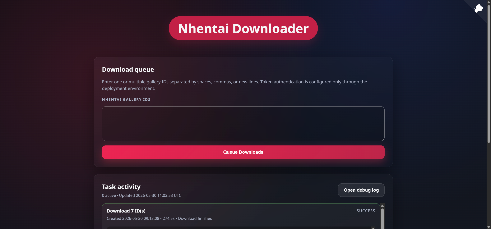

# nhentai-downloader-web

Generated by Codex(ChatGPT)

A simple and responsive Flask-based Web UI for the [nhentai CLI](https://github.com/RicterZ/nhentai).  
Easily download manga from nhentai.net using gallery ID, with cookie and user-agent support.



---

## ✨ Features

- 🔒 Password protection (set via environment variable)
- 🔽 Download by nhentai gallery ID
- 🍪 Cookie and User-Agent configuration
- 🧾 Real-time download logs (debug log viewer)
- 📦 Dockerized for easy deployment

---

### 🔌 Get to run

# Method 1: Git clone
```bash
git clone https://github.com/1030283726/nhentai-downloader-web.git
cd nhentai-downloader-web
python -m venv .venv
source .venv/bin/activate  # or .venv\Scripts\activate on Windows
pip install -r requirements.txt
python nhentai.py
```
Visit http://localhost:61234


# Method 2: Dockerhub
```bash
docker run -d -p 61234:61234 \
  -e NHENTAI_PASSWORD=yourpassword \
  -v /your-path:/nhentai \
  1030283726/nhentai-downloader-web
```


# Method 3: Build by Dockerfile
```bash
git clone https://github.com/1030283726/nhentai-downloader-web.git
cd nhentai-downloader-web

docker build -t nhentai-downloader-web .

docker run -d -p 61234:61234 \
  -e NHENTAI_PASSWORD=yourpassword \
  -v /your-path:/nhentai \
  nhentai-downloader-web
```

---
## ENV

| Variable           | Description                                                            | Default    | Example             |
|--------------------|------------------------------------------------------------------------|------------|---------------------|
| `NHENTAI_PASSWORD` | Password required to access the web UI. Stored in cookie for 30 days.  | `admin`    | `mystrongpassword` |
| `DOWNLOAD_PATH`    | Directory where downloaded doujins will be saved inside the container. | `/nhentai` | `/download`        |
| `DEFAULT_FORMAT`   | Default filename format.       | `%a%t`     | `%a%t-%i`          |


